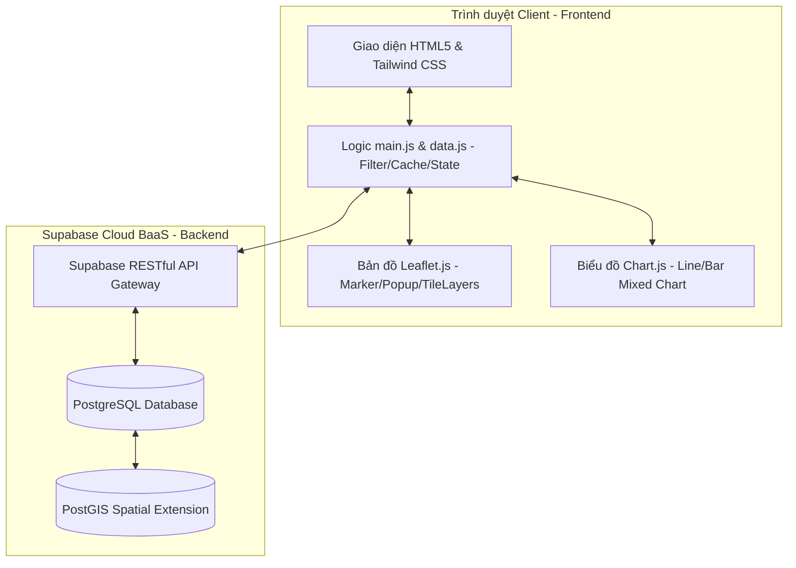

# ĐỒ ÁN MÔN HỌC: HỆ THỐNG WEBGIS GIÁM SÁT MỰC NƯỚC THỦY VĂN & LƯỢNG MƯA

> **Đề tài:** Xây dựng Dashboard WebGIS giám sát thời gian thực mực nước sông và lượng mưa tích lũy khu vực TP. Hồ Chí Minh kết nối cơ sở dữ liệu Supabase PostgreSQL & PostGIS.
> **Đối tượng chấm điểm:** Báo cáo khoa học & Sản phẩm thực nghiệm môn học phát triển phần mềm GIS mã nguồn mở / Phát triển ứng dụng WebGIS.

---

## 📝 1. ĐẶT VẤN ĐỀ & MỤC TIÊU ĐỀ TÀI

### 1.1. Tính cấp thiết của đề tài
TP. Hồ Chí Minh là đô thị lớn thường xuyên đối mặt với tình trạng ngập úng nghiêm trọng do triều cường, mưa lớn và xả lũ từ thượng nguồn. Việc xây dựng một hệ thống trực quan hóa không gian địa lý (WebGIS) kết hợp phân tích tương quan giữa lượng mưa và diễn biến mực nước sông theo chuỗi thời gian là cực kỳ cấp thiết. Hệ thống này giúp các nhà quản lý đô thị và người dân có cái nhìn trực quan, đưa ra quyết định ứng phó kịp thời với thiên tai.

### 1.2. Mục tiêu nghiên cứu
* Thiết kế cơ sở dữ liệu quan hệ tích hợp dữ liệu không gian địa lý **PostgreSQL + PostGIS** trên nền tảng đám mây Supabase để quản lý tập trung thông tin quan trắc thủy văn và lượng mưa.
* Xây dựng giao diện Dashboard tương tác trực quan thời gian thực, hiển thị các trạm đo trên bản đồ số và vẽ biểu đồ tương quan mưa - mực nước.
* Tích hợp hệ thống cảnh báo tự động dựa trên các ngưỡng báo động lũ quy chuẩn của Việt Nam (Báo động I, II, III).
* Triển khai giải pháp tối ưu hóa hiệu năng truyền tải dữ liệu Client-Server thông qua cơ chế tải phân tán (Lazy Loading) và lưu đệm (Caching).

---

## 📐 2. KIẾN TRÚC HỆ THỐNG (SYSTEM ARCHITECTURE)

Hệ thống được thiết kế theo mô hình kiến trúc Client-Server hiện đại, tận dụng giải pháp Backend-as-a-Service (BaaS) đám mây nhằm tối ưu hóa chi phí vận hành và tốc độ triển khai:



* **Client (Frontend)**:
  * **HTML5/Tailwind CSS**: Đảm nhận cấu trúc layout Responsive, tự động tối ưu giao diện trên Desktop, Tablet và Mobile.
  * **Leaflet.js**: Thư viện bản đồ nguồn mở tải các lớp bản đồ terrain số từ Esri World Topo Map, hiển thị các marker trạm đo địa lý và popup thông tin tương tác.
  * **Chart.js**: Trực quan hóa dữ liệu đo đạc thông qua biểu đồ hỗn hợp (Line & Bar) hai trục tung (Dual Y-Axis), tích hợp plugin `chartjs-plugin-annotation` vẽ ngưỡng báo động.
* **Server & Database (Backend)**:
  * **Supabase Client SDK**: Kết nối an toàn không trạng thái (Stateless) từ client lên server qua giao thức HTTPS RESTful API.
  * **PostgreSQL Database**: Lưu trữ dữ liệu quan hệ có cấu trúc chuẩn hóa.
  * **PostGIS Extension**: Quản lý dữ liệu không gian, tự động tính toán thuộc tính hình học điểm (`GEOMETRY(Point, 4326)`) của các trạm đo phục vụ truy vấn GIS.

---

## 🗄️ 3. MÔ HÌNH HÓA DỮ LIỆU (DATABASE SCHEMA)

Cơ sở dữ liệu bao gồm ba bảng chính được thiết kế đồng bộ 100% với dữ liệu từ các file Excel thực địa của Sở Tài nguyên & Môi trường:

### 3.1. Bảng Danh Sách Trạm (`danh_sach_tram`)
Quản lý thông tin cấu hình tĩnh, tọa độ và các ngưỡng cảnh báo của 16 trạm đo (Mực nước và Lượng mưa):

| Tên Cột | Kiểu Dữ Liệu | Khóa | Mô Tả Ý Nghĩa |
| :--- | :--- | :--- | :--- |
| `id` | VARCHAR(100) | Primary Key | Mã định danh trạm (Ví dụ: MN_phu_an, MUA_cat_lai) |
| `name` | VARCHAR(255) | | Tên trạm (Ví dụ: Phú An, Cát Lái) |
| `type` | VARCHAR(100) | | Loại trạm (Ví dụ: Trạm mực nước, Trạm đo mưa) |
| `typeColor` | VARCHAR(100) | | Màu sắc class CSS tương ứng với loại trạm |
| `dotColor` | VARCHAR(100) | | Màu hex của chấm tròn trạm trên bản đồ Leaflet |
| `lat` | DOUBLE PRECISION| | Vĩ độ địa lý WGS84 |
| `lng` | DOUBLE PRECISION| | Kinh độ địa lý WGS84 |
| `location` | VARCHAR(255) | | Địa bàn hành chính nơi đặt trạm (Xã/Quận/Huyện) |
| `elevations_peak`| DOUBLE PRECISION|| Độ cao đỉnh công trình thiết kế (m/cm) |
| `elevations_bed` | DOUBLE PRECISION|| Độ cao chân công trình thiết kế (m/cm) |
| `desc` | TEXT | | Mô tả tổng hợp dữ liệu trạm |
| `alarms_bd1` | DOUBLE PRECISION|| Ngưỡng mực nước báo động lũ cấp 1 |
| `alarms_bd2` | DOUBLE PRECISION|| Ngưỡng mực nước báo động lũ cấp 2 |
| `alarms_bd3` | DOUBLE PRECISION|| Ngưỡng mực nước báo động lũ cấp 3 |

### 3.2. Bảng Trạm Thủy Văn (`tram_thuy_van`)
Quản lý dữ liệu đo mực nước sông chi tiết theo chuỗi thời gian:

| Tên Cột | Kiểu Dữ Liệu | Khóa | Mô Tả Ý Nghĩa |
| :--- | :--- | :--- | :--- |
| `FID` | SERIAL | Primary Key | Khóa chính tự tăng |
| `IDtramMucN` | VARCHAR(100) | | Mã định danh bản ghi đo đạc mực nước |
| `tenTram` | VARCHAR(255) | | Tên trạm thủy văn (Ví dụ: Phú An, Nhà Bè) |
| `gio` | VARCHAR(50) | | Giờ thực hiện đo đạc (HH:mm:ss) |
| `ngay` | DATE | | Ngày đo đạc (YYYY-MM-DD) |
| `mucNuoc` | DOUBLE PRECISION| | Giá trị mực nước đo được (cm hoặc m) |
| `doCaoDinhT` | DOUBLE PRECISION| | Độ cao thiết kế đỉnh công trình |
| `doCaoChanT` | DOUBLE PRECISION| | Độ cao thiết kế chân công trình |
| `baoDongI` | DOUBLE PRECISION| | Ngưỡng mực nước báo động lũ cấp 1 |
| `baoDongII` | DOUBLE PRECISION| | Ngưỡng mực nước báo động lũ cấp 2 |
| `baoDongIII` | DOUBLE PRECISION| | Ngưỡng mực nước báo động lũ cấp 3 |
| `kinhDo` | DOUBLE PRECISION| | Kinh độ địa lý trạm (WGS84) |
| `viDo` | DOUBLE PRECISION| | Vĩ độ địa lý trạm (WGS84) |
| `geom` | GEOMETRY(Point, 4326)| | Thuộc tính không gian địa lý lưu điểm tọa độ trạm |

### 3.3. Bảng Trạm Lượng Mưa (`tram_luong_mua`)
Quản lý thông tin đo đạc lượng mưa tích lũy của các trạm khí tượng:

| Tên Cột | Kiểu Dữ Liệu | Khóa | Mô Tả Ý Nghĩa |
| :--- | :--- | :--- | :--- |
| `FID` | SERIAL | Primary Key | Khóa chính tự tăng |
| `IDtramMua` | VARCHAR(100) | | Mã định danh bản ghi đo đạc lượng mưa |
| `tenTram` | VARCHAR(255) | | Tên trạm đo mưa (Ví dụ: Cát Lái, Cần Giờ,...) |
| `capTram` | VARCHAR(100) | | Cấp của trạm khí tượng |
| `viTriTram` | VARCHAR(255) | | Mô tả chi tiết vị trí đặt trạm vật lý |
| `gio` | VARCHAR(50) | | Giờ thực hiện đo đạc |
| `ngay` | DATE | | Ngày đo đạc (YYYY-MM-DD) |
| `luongMua` | DOUBLE PRECISION| | Lượng mưa tích lũy đo được (mm) |
| `kinhDo` | DOUBLE PRECISION| | Kinh độ địa lý trạm (WGS84) |
| `viDo` | DOUBLE PRECISION| | Vĩ độ địa lý trạm (WGS84) |
| `geom` | GEOMETRY(Point, 4326)| | Thuộc tính không gian địa lý của trạm mưa |


---

## 💡 4. CÁC THUẬT TOÁN & KỸ THUẬT TỐI ƯU HÓA TRONG ĐỀ TÀI

Đồ án triển khai các giải pháp lập trình JavaScript nâng cao nhằm giải quyết các bài toán thực tế về mặt hiệu năng và trải nghiệm người dùng:

### 4.1. Giải pháp Lazy Loading & Caching vượt giới hạn Supabase
* **Vấn đề thực tế**: Supabase API giới hạn mặc định chỉ trả về tối đa 1000 dòng trên một câu truy vấn để bảo vệ băng thông máy chủ. Tuy nhiên, dữ liệu lịch sử một trạm (như Phú An) kéo dài từ 2008 đến 2022 có hơn 10.000 dòng. Đồng thời, tải toàn bộ dữ liệu 60.000 dòng của tất cả các trạm lúc khởi chạy trang web sẽ làm đơ trình duyệt.
* **Thuật toán khắc phục**:
  1. Khi tải trang, hệ thống gửi truy vấn bất đồng bộ đến bảng `danh_sach_tram` của Supabase để lấy cấu hình 16 trạm (tọa độ, tên, ngưỡng cảnh báo) để vẽ các marker lên bản đồ số ngay lập tức.
  2. Khi người dùng click vào một trạm đo cụ thể, client mới kích hoạt truy vấn tải dữ liệu chi tiết của riêng trạm đó bằng câu lệnh `.eq('tenTram', st.name).limit(25000)`. Chỉ số 25.000 đảm bảo lấy trọn vẹn 100% dữ liệu lịch sử qua nhiều năm.
  3. Sau khi tải thành công lần đầu, đối tượng trạm được đánh dấu `st.loaded = true`. Các lần tương tác sau sẽ lấy trực tiếp dữ liệu từ cache RAM của client, loại bỏ hoàn toàn các yêu cầu mạng lặp lại.

### 4.2. Gom nhóm dữ liệu theo Trạm thực tế (Group By Client-Side)
Mặc dù dữ liệu trong bảng CSDL được lưu trữ ở dạng phẳng (mỗi dòng đo là một hàng riêng biệt), hệ thống đã xây dựng cấu trúc Map-Reduce trong JavaScript để tự động gom nhóm hàng chục nghìn bản ghi đó thành 16 đối tượng trạm duy nhất dựa trên thuộc tính **`tenTram` (Tên trạm)** kết hợp tiền tố loại trạm (`MN_` cho mực nước và `MUA_` cho lượng mưa). Điều này ngăn ngừa tình trạng sinh ra hàng vạn marker rác trùng tọa độ trên bản đồ.

### 4.3. Đồng bộ hóa bộ lọc thời gian tự động (Dynamic Dropdowns Filter)
* Hệ thống tự động phân tích mảng dữ liệu ngày đo đạc thực tế của trạm đang chọn để sinh ra danh sách các Năm và Tháng có dữ liệu duy nhất, tự động ẩn đi các năm/tháng không đo đạc nhằm tránh lỗi hiển thị biểu đồ trống.
* Tích hợp thuật toán chuyển đổi trạm thông minh: Khi đổi trạm, nếu đang ở chế độ lọc thủ công, hệ thống tự động kiểm tra xem trạm mới có dữ liệu trong khoảng thời gian đó không. Nếu có thì hiển thị tiếp, nếu không có thì tự động trả về chế độ mặc định hiển thị 30 ngày gần nhất của trạm mới.

---

## 🛠️ 5. HƯỚNG DẪN CẤU HÌNH & KHỞI CHẠY HỆ THỐNG

### 5.1. Thiết lập CSDL trên Supabase Cloud
1. Đăng ký tài khoản miễn phí tại [Supabase](https://supabase.com) và tạo một Project mới.
2. Truy cập mục **SQL Editor**, tạo một query mới, sao chép toàn bộ mã SQL dưới đây và nhấn **Run** để khởi tạo các bảng và trigger PostGIS tự động:

```sql
-- Kích hoạt extension không gian địa lý PostGIS
CREATE EXTENSION IF NOT EXISTS postgis;

-- Tạo bảng danh sách trạm
CREATE TABLE danh_sach_tram (
    id VARCHAR(100) PRIMARY KEY,
    name VARCHAR(255) NOT NULL,
    type VARCHAR(100),
    "typeColor" VARCHAR(100),
    "dotColor" VARCHAR(100),
    lat DOUBLE PRECISION,
    lng DOUBLE PRECISION,
    location VARCHAR(255),
    elevations_peak DOUBLE PRECISION,
    elevations_bed DOUBLE PRECISION,
    "desc" TEXT,
    alarms_bd1 DOUBLE PRECISION,
    alarms_bd2 DOUBLE PRECISION,
    alarms_bd3 DOUBLE PRECISION
);

-- Tạo bảng dữ liệu trạm thủy văn
CREATE TABLE tram_thuy_van (
    "FID" SERIAL PRIMARY KEY,
    "IDtramMucN" VARCHAR(100),
    "tenTram" VARCHAR(255),
    "gio" VARCHAR(50),
    "ngay" DATE,
    "toaDoX" DOUBLE PRECISION,
    "toaDoY" DOUBLE PRECISION,
    "mucNuoc" DOUBLE PRECISION,
    "doCaoDinhT" DOUBLE PRECISION,
    "doCaoChanT" DOUBLE PRECISION,
    "baoDongI" DOUBLE PRECISION,
    "baoDongII" DOUBLE PRECISION,
    "baoDongIII" DOUBLE PRECISION,
    "maXa" VARCHAR(100),
    "maHuyen" VARCHAR(100),
    "maXaHuyen" VARCHAR(100),
    "ghiChu" TEXT,
    "kinhDo" DOUBLE PRECISION,
    "viDo" DOUBLE PRECISION,
    "day" INTEGER,
    "month" INTEGER,
    "year" INTEGER
);

-- Trigger tự động đồng bộ hóa cột geom (Geometry Point) từ kinhDo/viDo cho trạm thủy văn
ALTER TABLE tram_thuy_van ADD COLUMN geom GEOMETRY(Point, 4326);
CREATE OR REPLACE FUNCTION update_geom_from_coordinates()
RETURNS TRIGGER AS $$
BEGIN
    IF NEW."kinhDo" IS NOT NULL AND NEW."viDo" IS NOT NULL THEN
        NEW.geom := ST_SetSRID(ST_Point(NEW."kinhDo", NEW."viDo"), 4326);
    END IF;
    RETURN NEW;
END;
$$ LANGUAGE plpgsql;

CREATE TRIGGER trigger_update_geom
BEFORE INSERT OR UPDATE ON tram_thuy_van
FOR EACH ROW EXECUTE FUNCTION update_geom_from_coordinates();

-- Tạo bảng dữ liệu trạm lượng mưa
CREATE TABLE tram_luong_mua (
    "FID" SERIAL PRIMARY KEY,
    "IDtramMua" VARCHAR(100),
    "tenTram" VARCHAR(255),
    "capTram" VARCHAR(100),
    "viTriTram" VARCHAR(255),
    "gio" VARCHAR(50),
    "ngay" DATE,
    "toaDoX" DOUBLE PRECISION,
    "toaDoY" DOUBLE PRECISION,
    "luongMua" DOUBLE PRECISION,
    "maXa" VARCHAR(100),
    "maHuyen" VARCHAR(100),
    "ghiChu" TEXT,
    "kinhDo" DOUBLE PRECISION,
    "viDo" DOUBLE PRECISION,
    "day" INTEGER,
    "month" INTEGER,
    "year" INTEGER
);

-- Trigger tự động đồng bộ hóa cột geom (Geometry Point) từ kinhDo/viDo cho trạm lượng mưa
ALTER TABLE tram_luong_mua ADD COLUMN geom GEOMETRY(Point, 4326);
CREATE OR REPLACE FUNCTION update_geom_rain_coordinates()
RETURNS TRIGGER AS $$
BEGIN
    IF NEW."kinhDo" IS NOT NULL AND NEW."viDo" IS NOT NULL THEN
        NEW.geom := ST_SetSRID(ST_Point(NEW."kinhDo", NEW."viDo"), 4326);
    END IF;
    RETURN NEW;
END;
$$ LANGUAGE plpgsql;

CREATE TRIGGER trigger_update_geom_rain
BEFORE INSERT OR UPDATE ON tram_luong_mua
FOR EACH ROW EXECUTE FUNCTION update_geom_rain_coordinates();

-- VÔ HIỆU HÓA RLS ĐỂ CHO PHÉP CLIENT TRUY CẬP CÔNG KHAI
ALTER TABLE danh_sach_tram DISABLE ROW LEVEL SECURITY;
ALTER TABLE tram_thuy_van DISABLE ROW LEVEL SECURITY;
ALTER TABLE tram_luong_mua DISABLE ROW LEVEL SECURITY;
```

3. Vào mục **Table Editor** trên Supabase và tải các file dữ liệu dạng `.csv` lên tương ứng 3 bảng:
   * Bảng `danh_sach_tram`: Tải lên tệp CSV mẫu đã xuất sẵn tại `C:\Users\admin\Downloads\danh_sach_tram.csv`.
   * Bảng `tram_thuy_van` và `tram_luong_mua`: Tải lên các file dữ liệu đo đạc thực địa thủy văn và đo mưa tương ứng.

### 5.2. Cấu hình khóa kết nối API bảo mật
Để đảm bảo an toàn thông tin và không bị lộ khóa kết nối (Credentials) lên GitHub:
1. Sao chép tệp mẫu cấu hình [config.example.js](file:///assets/js/config.example.js) và đổi tên thành `config.js` trong thư mục `assets/js/`:
   ```bash
   cp assets/js/config.example.js assets/js/config.js
   ```
2. Mở tệp [assets/js/config.js](file:///assets/js/config.js) vừa tạo và cập nhật thông tin API của dự án Supabase của bạn:
   ```javascript
   const CONFIG = {
       SUPABASE_URL: 'https://your-project-id.supabase.co', // Thay thế bằng URL dự án của bạn
       SUPABASE_ANON_KEY: 'eyJhbGciOiJIUzI1NiIsInR5cCI6...' // Thay thế bằng Anon Key của bạn
   };
   ```
   *(Tệp `config.js` đã được thêm vào `.gitignore` nên sẽ không bao giờ bị đẩy lên GitHub)*


### 5.3. Khởi chạy thử nghiệm
* **Chạy Local**: Mở tệp `index.html` trực tiếp bằng trình duyệt Web hoặc sử dụng công cụ **Live Server** trên VS Code.
* **Triển khai Production**: Nhờ có cấu hình định tuyến sẵn trong `vercel.json`, bạn có thể đẩy mã nguồn lên GitHub và kết nối với **Vercel** để deploy trực tuyến miễn phí chỉ trong một click chuột.

---

## 📈 6. ĐÁNH GIÁ KẾT QUẢ ĐỀ TÀI (KẾT LUẬN)

* **Về mặt kỹ thuật**: Đề tài xây dựng thành công ứng dụng WebGIS tương tác hai chiều mượt mà giữa Bản đồ số không gian địa lý và Biểu đồ chuỗi thời gian phân giải cao. Khắc phục triệt để các giới hạn xử lý mạng của Supabase và lỗi phân tách dữ liệu địa lý thực tế.
* **Về mặt mỹ thuật**: Giao diện ứng dụng được thiết kế hiện đại, bố cục rõ ràng theo chuẩn các phòng điều hành giám sát thiên tai đô thị (Dashboard Glassmorphism), hỗ trợ Responsive hoàn hảo trên mọi thiết bị.
* **Về mặt thực tiễn**: Đồ án có khả năng áp dụng cao vào công tác quản lý tài nguyên nước, cảnh báo ngập lụt tại các quận huyện trên địa bàn TP. Hồ Chí Minh bằng việc sử dụng dữ liệu thực tế do cơ quan quan trắc cung cấp.
