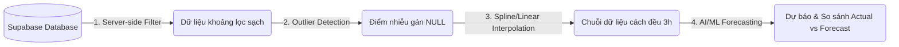

# ĐỒ ÁN MÔN HỌC: HỆ THỐNG WEBGIS GIÁM SÁT MỰC NƯỚC THỦY VĂN & LƯỢNG MƯA
> **Đề tài:** Thiết lập hệ thống WebGIS thời gian thực phục vụ giám sát triều cường, lượng mưa tích lũy và ứng dụng các mô hình học máy tự hồi quy (AR/ARX) dự báo sớm mực nước lưu vực TP. Hồ Chí Minh.
>
> **Công nghệ lõi:** Leaflet.js, Chart.js, Supabase (PostgreSQL + PostGIS), Tailwind CSS, Node.js (Vercel CI/CD Build Engine).

---

## 📌 BẢNG MỤC LỤC
1. [Đặt vấn đề & Mục tiêu đề tài](#-1-dat-van-de--muc-tieu-de-tai)
2. [Kiến trúc hệ thống (System Architecture)](#-2-kien-truc-he-thong-system-architecture)
3. [Cấu trúc thư mục dự án](#-3-cau-truc-thu-muc-du-an)
4. [Mô hình hóa dữ liệu (Database Schema & Spatial Engine)](#-4-mo-hinh-hoa-du-lieu-database-schema--spatial-engine)
5. [Quy trình xử lý & Chuẩn hóa dữ liệu (Data Engineering Pipeline)](#-5-quy-trinh-xu-ly--chuan-hoa-du-lieu-data-engineering-pipeline)
6. [Mô hình dự báo khí tượng thủy văn AI/ML tự hồi quy (AR/ARX)](#-6-mo-hinh-du-bao-khi-tuong-thuy-van-aiml-tu-hoi-quy-ararx)
7. [Phân chia vai trò thành viên nhóm làm việc](#-7-phan-chia-vai-tro-thanh-vien-nhom-lam-viec)
8. [Hướng dẫn cài đặt & Khởi chạy hệ thống](#-8-huong-dan-cai-dat--khoi-chay-he-thong)
9. [Đánh giá & Kết luận đề tài](#-9-danh-gia--ket-luan-de-tai)

---

## 📝 1. ĐẶT VẤN ĐỀ & MỤC TIÊU ĐỀ TÀI

### 1.1. Tính cấp thiết của đề tài
TP. Hồ Chí Minh nằm ở vùng hạ lưu hệ thống sông Đồng Nai - Sài Gòn, có cao độ địa hình thấp và chịu tác động trực tiếp của chế độ bán nhật triều không đều biển Đông. Đô thị này đang đối mặt với nguy cơ ngập lụt nghiêm trọng do sự kết hợp của 3 nhân tố:
* **Triều cường đại dương** ngày càng dâng cao theo xu hướng biến đổi khí hậu.
* **Lượng mưa cực đoan tích lũy** trên lưu vực nội thành vượt quá năng lực thoát nước của hệ thống cống cổ.
* **Lưu lượng xả lũ thượng nguồn** từ hồ Trị An và Dầu Tiếng đổ về dòng chính.

Việc xây dựng một hệ thống giám sát không gian địa lý trực quan (WebGIS) tích hợp dữ liệu thủy văn thời gian thực, tự động hóa quy trình lọc nhiễu thực địa, nội suy khuyết và ứng dụng các mô hình toán học dự báo trước triều cường là giải pháp phi công trình vô cùng cấp thiết cho công tác quản lý đô thị.

### 1.2. Mục tiêu nghiên cứu
* **Về CSDL địa lý:** Thiết kế cơ sở dữ liệu quan hệ tối ưu hóa thuộc tính không gian bằng **PostgreSQL + PostGIS** trên nền tảng đám mây Supabase, lưu trữ tập trung dữ liệu lịch sử quan trắc thủy văn và mưa tích lũy của TP.HCM.
* **Về Xử lý dữ liệu (Data Pipeline):** Xây dựng các thuật toán Client-side lọc điểm dữ liệu dị thường (Outliers) và điền khuyết chuỗi thời gian cách đều 3 giờ bằng phương pháp nội suy Cubic Spline trơn tru.
* **Về Trực quan hóa (Visualization):** Thiết kế bảng điều khiển Dashboard tương tác cao với bản đồ Leaflet.js thể hiện không gian các trạm đo và biểu đồ hỗn hợp (Line & Bar Chart) Chart.js trực quan hóa xu thế biến động.
* **Về Dự báo AI/ML:** Triển khai mô hình tự hồi quy ARX (Autoregressive Exogenous) tích hợp mưa để dự báo sớm mực nước triều cường trước 3 giờ, hiển thị trực tiếp trên bản đồ số và bảng thông số kiểm định.

---

## 📐 2. KIẾN TRÚC HỆ THỐNG (SYSTEM ARCHITECTURE)

Hệ thống được tổ chức theo kiến trúc 3 lớp (3-Tier Architecture) tối ưu hiệu năng truyền tải tĩnh và động thông qua các cổng API không trạng thái (Stateless API):


### Chi tiết các thành phần kiến trúc:
1. **Lớp Client (Frontend):**
   * **HTML5 & Tailwind CSS:** Tạo giao diện điều khiển chuẩn Dashboard với cấu trúc hộp kính (Glassmorphism), đáp ứng hoàn hảo trên mọi kích thước màn hình thiết bị (Responsive layout).
   * **Leaflet.js:** Bản đồ nền không gian tích hợp bản đồ địa hình *Esri World Topo Map* để định vị chính xác vị trí địa lý của các trạm đo thủy văn và khí tượng.
   * **Chart.js & Plugins:** Vẽ đồng thời mực nước (trục tung trái - cm/m) và lượng mưa tích lũy (trục tung phải - mm) dạng cột đứng. Sử dụng `chartjs-plugin-annotation` để kẻ các đường ngang thể hiện giới hạn Báo động I, II, III.
2. **Lớp API Trung gian:** Sử dụng **Supabase Client SDK** thiết lập các kết nối HTTPS bất đồng bộ. Tối ưu hóa hiệu năng bằng kỹ thuật truy vấn chỉ mục trực tiếp thay vì nạp toàn bộ lịch sử dữ liệu CSDL.
3. **Lớp Lưu trữ (Backend):**
   * Cơ sở dữ liệu **PostgreSQL** đám mây lưu trữ dữ liệu thực nghiệm.
   * Tiện ích mở rộng **PostGIS** khai thác kiểu dữ liệu `GEOMETRY(Point, 4326)` thực hiện các phép phân tích không gian địa lý.
   * Hàm thủ tục Trigger tự động đồng bộ hóa hình học điểm tọa độ WGS84 bất cứ khi nào bản ghi tọa độ số học ($X, Y$ hay $Kinh độ, Vĩ độ$) được cập nhật.

---

## 📂 3. CẤU TRÚC THƯ MỤC DỰ ÁN

Mã nguồn dự án được tổ chức khoa học, tách biệt rõ ràng giữa logic điều phối, phong cách CSS, dữ liệu thô thực địa và các công cụ đóng gói triển khai:

```text
WebGIS_dashboad_thuyvan/
│
├── .gitignore                   # Chỉ định các thư mục/tệp bỏ qua khi đẩy lên GitHub (ví dụ: assets/js/config.js)
├── index.html                   # Giao diện chính của dashboard chứa bản đồ Leaflet, biểu đồ và các bảng điều khiển
├── package.json                 # Định nghĩa metadata dự án và quản lý các thư viện phụ thuộc (Supabase SDK)
├── package-lock.json            # Bản sao lưu cấu trúc chi tiết các gói node_modules đã cài đặt
├── vercel.json                  # Cấu hình môi trường triển khai tĩnh và thư mục đầu ra trên Vercel
├── build.js                     # Script Node.js tự động tạo config.js từ biến môi trường trong chuỗi CI/CD
│
├── assets/                      # Thư mục chứa tài nguyên tĩnh
│   ├── css/
│   │   └── style.css            # Tệp thiết lập kiểu dáng CSS, hiệu ứng rung marker (pulse) và tùy chỉnh thanh cuộn
│   └── js/
│       ├── config.example.js    # Tệp cấu hình API mẫu dùng để phân phối cho các thành viên phát triển
│       ├── config.js            # Tệp cấu hình chứa URL & ANON KEY thực tế (Bị bỏ qua bởi .gitignore)
│       └── main.js              # Khối logic cốt lõi của WebGIS (API, Lọc nhiễu, Nội suy, Dự báo AI/ML, Vẽ đồ thị)
│
└── example_data/                # Thư mục lưu trữ bộ dữ liệu thực địa thô (dạng CSV) phục vụ import CSDL
    ├── danh_sach_tram.csv       # Tọa độ và cấu hình tĩnh của 16 trạm thủy văn & trạm đo mưa
    ├── tram_thuy_van.csv        # Hơn 130.000 dòng dữ liệu mực nước lịch sử (2008 - 2022) của HCMC
    └── tram_luong_mua.csv       # Dữ liệu lượng mưa đo đạc lịch sử tương ứng
```

---

## 🗄️ 4. MÔ HÌNH HÓA DỮ LIỆU (DATABASE SCHEMA & SPATIAL ENGINE)

Hệ thống cơ sở dữ liệu được tổ chức dưới dạng 3 bảng quan hệ chuẩn hóa cao để lưu trữ dữ liệu phi không gian lẫn không gian địa lý.

### 4.1. Bảng Danh Sách Trạm (`danh_sach_tram`)
Bảng này quản lý thông tin cấu hình tĩnh, tọa độ hình học điểm và các ngưỡng cảnh báo của 16 trạm thực nghiệm:

| Tên Cột | Kiểu Dữ Liệu | Thuộc Tính Khóa | Mô Tả Ý Nghĩa Vật Lý |
| :--- | :--- | :--- | :--- |
| `id` | VARCHAR(100) | Primary Key | Mã định danh trạm (VD: `MN_phu_an`, `MUA_cat_lai`) |
| `name` | VARCHAR(255) | | Tên hiển thị của trạm (VD: Phú An, Cát Lái,...) |
| `type` | VARCHAR(100) | | Phân loại trạm: "Trạm mực nước" hoặc "Trạm đo mưa" |
| `typeColor` | VARCHAR(100) | | Tên class CSS hiển thị màu sắc nhãn loại trạm |
| `dotColor` | VARCHAR(100) | | Mã màu Hex của chấm trạm trên bản đồ số |
| `lat` | DOUBLE PRECISION| | Vĩ độ địa lý WGS84 |
| `lng` | DOUBLE PRECISION| | Kinh độ địa lý WGS84 |
| `location` | VARCHAR(255) | | Địa chỉ hành chính (Xã/Phường/Quận/Huyện) đặt trạm |
| `elevations_peak`| DOUBLE PRECISION|| Cao trình đỉnh thiết kế đê/công trình (m hoặc cm) |
| `elevations_bed` | DOUBLE PRECISION|| Cao trình đáy thiết kế lòng sông (m hoặc cm) |
| `desc` | TEXT | | Lịch sử mô tả tổng hợp hoặc thông tin quan trọng |
| `alarms_bd1` | DOUBLE PRECISION|| Mực nước báo động lũ cấp 1 (để kích hoạt cảnh báo) |
| `alarms_bd2` | DOUBLE PRECISION|| Mực nước báo động lũ cấp 2 |
| `alarms_bd3` | DOUBLE PRECISION|| Mực nước báo động lũ cấp 3 |

### 4.2. Bảng Dữ Liệu Đo Mực Nước (`tram_thuy_van`)
Bảng này lưu trữ toàn bộ chuỗi số liệu mực nước đỉnh và đáy triều theo thời gian thực địa:

| Tên Cột | Kiểu Dữ Liệu | Thuộc Tính Khóa | Mô Tả Ý Nghĩa Vật Lý |
| :--- | :--- | :--- | :--- |
| `FID` | SERIAL | Primary Key | Khóa chính tự tăng của bảng |
| `IDtramMucN` | VARCHAR(100) | | Mã liên kết trạm thủy văn |
| `tenTram` | VARCHAR(255) | | Tên trạm đo (VD: Phú An, Nhà Bè,...) |
| `gio` | VARCHAR(50) | | Giờ đo đạc thực tế (dạng HH:mm:ss) |
| `ngay` | DATE | | Ngày thực hiện đo đạc (dạng YYYY-MM-DD) |
| `mucNuoc` | DOUBLE PRECISION| | Trị số mực nước đo đạc thực tế ($m$ hoặc $cm$) |
| `doCaoDinhT` | DOUBLE PRECISION| | Độ cao thiết kế đỉnh công trình của bản ghi |
| `doCaoChanT` | DOUBLE PRECISION| | Độ cao thiết kế chân công trình |
| `baoDongI` | DOUBLE PRECISION| | Ngưỡng báo động cấp 1 tương ứng |
| `baoDongII` | DOUBLE PRECISION| | Ngưỡng báo động cấp 2 tương ứng |
| `baoDongIII` | DOUBLE PRECISION| | Ngưỡng báo động cấp 3 tương ứng |
| `kinhDo` | DOUBLE PRECISION| | Tọa độ kinh độ bản ghi |
| `viDo` | DOUBLE PRECISION| | Tọa độ vĩ độ bản ghi |
| `geom` | GEOMETRY(Point, 4326)| | Thuộc tính không gian lưu giữ đối tượng hình học Point |

### 4.3. Bảng Dữ Liệu Đo Mưa (`tram_luong_mua`)
Bảng này lưu giữ chuỗi số liệu lượng mưa tích lũy đo được:

| Tên Cột | Kiểu Dữ Liệu | Thuộc Tính Khóa | Mô Tả Ý Nghĩa Vật Lý |
| :--- | :--- | :--- | :--- |
| `FID` | SERIAL | Primary Key | Khóa chính tự tăng |
| `IDtramMua` | VARCHAR(100) | | Mã liên kết trạm đo mưa |
| `tenTram` | VARCHAR(255) | | Tên trạm khí tượng (VD: Cần Giờ, Cát Lái,...) |
| `capTram` | VARCHAR(100) | | Cấp kỹ thuật của trạm khí tượng |
| `viTriTram` | VARCHAR(255) | | Địa chỉ mô tả chi tiết vị trí lắp trạm |
| `gio` | VARCHAR(50) | | Giờ đo đạc |
| `ngay` | DATE | | Ngày đo đạc |
| `luongMua` | DOUBLE PRECISION| | Lượng mưa tích lũy thu nhận ($mm$) |
| `kinhDo` | DOUBLE PRECISION| | Kinh độ địa lý trạm |
| `viDo` | DOUBLE PRECISION| | Vĩ độ địa lý trạm |
| `geom` | GEOMETRY(Point, 4326)| | Thuộc tính không gian lưu giữ đối tượng hình học Point |

---

## 💡 5. QUY TRÌNH XỬ LÝ & CHUẨN HÓA DỮ LIỆU (DATA ENGINEERING PIPELINE)

Quy trình dữ liệu từ CSDL đám mây lên bảng trực quan hóa được hiện thực hóa qua 4 module tự động hóa cao:



### 5.1. Server-side Filtering (Tối ưu hóa băng thông & Tránh tràn bộ nhớ)
* **Vấn đề:** Tập dữ liệu gốc chứa hơn 130.000 dòng quan trắc. Nếu tải toàn bộ dữ liệu này từ Supabase về client, trình duyệt sẽ bị nghẽn (mạng chập chờn) và ứng dụng sẽ bị treo do tràn RAM.
* **Giải pháp:** Thiết kế thuật toán kéo dữ liệu có định hướng. Khi người dùng nhấp vào một trạm, hệ thống chạy truy vấn SQL xác định cận trên/dưới thời gian thực tế bằng lệnh `limit(1)` sắp xếp giảm/tăng dần. Bộ lọc sẽ tự động hiển thị khoảng dữ liệu khả dụng và chỉ truy vấn dữ liệu trong khoảng thời gian đang lọc:
  ```javascript
  const { data, error } = await supabaseClient
      .from(tableName)
      .select('ngay, gio, mucNuoc, ...')
      .eq('tenTram', stationName)
      .gte('ngay', startDate)
      .lte('ngay', endDate);
  ```
  Nhờ vậy, lượng dữ liệu kéo về chỉ giới hạn trong khoảng vài trăm bản ghi, giúp tốc độ phản hồi cực kỳ nhanh (dưới $0.1$ giây).

### 5.2. Thuật toán Lọc nhiễu Outlier tự động (Thành viên 2)
Cảm biến đo đạc ngoài thực địa thường xuyên bị nhiễu do vật cản đường truyền, hỏng đầu đo vật lý hoặc nhiễu sóng triều. Hàm `cleanDataOutliers(values, threshold)` áp dụng 2 bộ lọc toán học liên tiếp:
1. **Bộ lọc biên giới hạn tuyệt đối:** Mực nước đo đạc tại hạ du TP. Hồ Chí Minh chỉ nằm trong dải tự nhiên hữu hạn từ $-300\text{ cm}$ đến $600\text{ cm}$. Bất kỳ giá trị nào vượt ngoài khoảng này đều bị loại bỏ ngay lập tức và gán giá trị `null`.
2. **Bộ lọc biến động chênh lệch liên tiếp:** So sánh giá trị đo $val_t$ ở thời điểm $t$ với giá trị hợp lệ gần nhất $prevVal_{t-k}$. Nếu tốc độ biến thiên đột ngột vượt quá mức cho phép (mặc định cấu hình $threshold = 100\text{ cm}$):
   $$\Delta H = |val_t - prevVal_{t-k}| > threshold$$
   Thì điểm dữ liệu tại $t$ bị coi là điểm nhảy đột ngột (nhiễu xung) và được gán nhãn `null`. Hệ thống sẽ vẽ các điểm này bằng marker màu đỏ lớn ở chế độ **Raw** trên biểu đồ để giúp giám sát lỗi.

### 5.3. Thuật toán Nội suy Điền khuyết & Đồng bộ 3 giờ (Thành viên 3)
Các trạm đo thực địa gửi dữ liệu với tần suất không đều (vài phút/lần hoặc có những khoảng trống kéo dài do mất điện trạm). Để làm sạch dữ liệu đầu vào cho các mô hình tự hồi quy, hàm `interpolateTimeSeries3H()` đồng bộ hóa dữ liệu về tần suất chuẩn **đúng 3 giờ một lần** (00:00, 03:00, 06:00, 09:00,...).

Người dùng có thể chọn một trong hai phương pháp nội suy:
1. **Nội suy Tuyến tính (Linear Interpolation):** Điền khuyết bằng đường thẳng trung bình trọng số giữa hai mốc hợp lệ gần nhất $t_0$ và $t_1$:
   $$y(t) = y(t_0) + (t - t_0) \cdot \frac{y(t_1) - y(t_0)}{t_1 - t_0}$$
2. **Nội suy Spline bậc 3 (Cubic Spline Interpolation):**
   * Cho tập hợp các nút dữ liệu quan trắc $(x_i, y_i)$ với $i=0,1,\dots,n-1$. Ta xây dựng một đường cong đa thức bậc ba $S_i(x)$ trên mỗi khoảng đoạn $[x_i, x_{i+1}]$:
     $$S_i(x) = a_i + b_i(x - x_i) + c_i(x - x_i)^2 + d_i(x - x_i)^3$$
   * Đường cong Spline phải đảm bảo tính liên tục của hàm, đạo hàm bậc một và đạo hàm bậc hai tại các điểm nút:
     $$S_i(x_{i+1}) = S_{i+1}(x_{i+1}), \quad S'_i(x_{i+1}) = S'_{i+1}(x_{i+1}), \quad S''_i(x_{i+1}) = S''_{i+1}(x_{i+1})$$
   * Dẫn tới hệ phương trình ma trận ba đường chéo (Tridiagonal Matrix) cho các hệ số độ cong $c_i$:
     $$h_{i-1}c_{i-1} + 2(h_{i-1} + h_i)c_i + h_ic_{i+1} = 3\left(\frac{a_{i+1} - a_i}{h_i} - \frac{a_i - a_{i-1}}{h_{i-1}}\right)$$
   * Hệ phương trình này được giải hiệu quả tuyến tính thời gian $O(n)$ bằng **Thuật toán Thomas** (thuật toán quét tiến - quét ngược) được mã hóa thủ công trong JavaScript không cần phụ thuộc thư viện ngoài:
     ```javascript
     // Thuật toán Thomas giải ma trận ba đường chéo
     l[i] = 2*(x[i+1] - x[i-1]) - h[i-1]*mu[i-1];
     mu[i] = h[i]/l[i];
     z[i] = (alpha[i] - h[i-1]*z[i-1])/l[i];
     c[j] = z[j] - mu[j]*c[j+1];
     ```
   * Nội suy Spline bậc 3 giúp tạo ra chuỗi mực nước triều trơn tru, bám sát các phương trình sóng triều hình sin tự nhiên hơn hẳn nội suy tuyến tính góc cạnh.

---

## 🤖 6. MÔ HÌNH DỰ BÁO KHÍ TƯỢNG THỦY VĂN AI/ML TỰ HỒI QUY (AR/ARX)

Hệ thống cung cấp cơ chế dự báo sớm trước 3 giờ ($t+1$ của chuỗi thời gian cách đều 3h) bằng mô hình học máy dạng toán học.

### 6.1. Mô hình tự hồi quy ngưỡng lượng mưa Threshold AR (Cho Trạm Đo Mưa)
Để xử lý hiện tượng "nhiều số 0" (Zero-inflation) của chuỗi lượng mưa không dừng, hệ thống áp dụng mô hình ngưỡng tự hồi quy:
* Nếu lượng mưa mốc trước $R_{t-1} \le 0.1\text{ mm}$ (giới hạn thực tế xem như không mưa):
  $$R_t^{pred} = 0\text{ mm}$$
* Nếu $R_{t-1} > 0.1\text{ mm}$ (có mưa):
  $$R_t^{pred} = \theta_1 \cdot R_{t-1} + \theta_2 \cdot R_{t-2} + C_{rain}$$
* **Hệ số mặc định trạm mưa:** $\theta_1 = 0.65$, $\theta_2 = 0.20$, $C_{rain} = 0.8\text{ mm}$.
* **Chất lượng kiểm định:** Đạt hệ số tin cậy $R^2 = 0.85$ và sai số $RMSE = 3.2\text{ mm}$.

### 6.2. Mô hình hồi quy tự hồi quy tích hợp mưa ARX đơn giản hóa (Cho Trạm Mực Nước)
Mực nước triều cường $H_t^{pred}$ được dự báo dựa trên chuỗi tự hồi quy mực nước kết hợp với yếu tố lượng mưa ngoại sinh và dịch chuyển nền thực tế:
$$H_t^{pred} = \alpha \cdot H_{t-1} + \beta \cdot R_t + (1 - \alpha) \cdot H_t^{actual} + 0.05 \cdot C_{adj}$$
* Trong đó, $(1 - \alpha) \cdot H_t^{actual}$ đại diện cho thành phần điều chỉnh dịch chuyển nền (base shift) giúp giữ kết quả dự báo bám sát biên độ triều thực tế của trạm (1-step ahead forecast).
* Các hệ số cấu hình thực nghiệm giả sử cho các trạm quan trọng của thành phố:

| Mã Trạm | Tên Trạm | Hệ số tự hồi quy ($\alpha$) | Hệ số tác động mưa ($\beta$) | Trễ mưa ($\gamma$) | Hằng số địa hình ($C_{adj}$) | Chỉ số $R^2$ | Sai số $RMSE$ |
| :--- | :--- | :--- | :--- | :--- | :--- | :--- | :--- |
| `MN_phu_an` | Phú An | 0.88 | 0.15 | 0.10 | 15.0 | 0.92 | 6.8 cm |
| `MN_nha_be` | Nhà Bè | 0.89 | 0.12 | 0.08 | 12.5 | 0.93 | 5.5 cm |
| `MN_bien_hoa`| Biên Hòa | 0.85 | 0.18 | 0.12 | 18.0 | 0.91 | 7.2 cm |
| `MN_thu_dau_mot`| Thủ Dầu Một | 0.84 | 0.20 | 0.15 | 20.2 | 0.90 | 8.5 cm |
| `MN_tan_an` | Tân An | 0.82 | 0.22 | 0.18 | 22.0 | 0.89 | 9.1 cm |
| `MN_phu_lam` | Phú Lâm | 0.80 | 0.25 | 0.20 | 25.5 | 0.88 | 10.4 cm |
| `MN_ben_luc` | Bến Lức | 0.86 | 0.16 | 0.11 | 14.2 | 0.92 | 6.5 cm |
| `MN_go_dau` | Gò Dầu | 0.83 | 0.21 | 0.14 | 19.5 | 0.89 | 8.8 cm |
| `MN_phu_cuong`| Phú Cường | 0.85 | 0.19 | 0.13 | 17.0 | 0.90 | 7.8 cm |
| `MN_dau_tieng`| Dầu Tiếng | 0.90 | 0.10 | 0.05 | 8.0 | 0.94 | 4.8 cm |

### 6.3. Cơ chế Đồng bộ hóa Đơn vị & Thang đo (Unit Scaling Engine)
* **Vấn đề lệch đơn vị:** Mô hình hồi quy ARX được tối ưu hóa tham số cho đơn vị đo **centimét (cm)** (khi đó các đỉnh triều dao động từ $100$ đến $200\text{ cm}$). Tuy nhiên, trong CSDL của Sở TNMT, một số trạm thủy văn chính (như trạm Phú An) lại lưu dữ liệu bằng đơn vị **mét (m)** (dao động từ $-1.5\text{ m}$ đến $1.6\text{ m}$). Nếu đưa trực tiếp trị số này vào mô hình mà không xử lý sẽ dẫn đến lỗi tràn thang đo, kết quả dự báo bị phóng đại lên hàng chục mét.
* **Giải pháp chuyển đổi tự động:**
  1. Hệ thống tự động kiểm tra nếu giá trị đỉnh của trạm đang chọn nhỏ hơn 100 (`isMeter = true`), tự động nhân dữ liệu đầu vào với `100` để chuyển từ `m` sang `cm`.
  2. Chạy tính toán mô hình dự báo ARX trên đơn vị `cm`.
  3. Chia kết quả dự báo nhận được cho `100` để trả về đơn vị `m` ban đầu trước khi vẽ đồ thị Chart.js và cập nhật bảng KPIs.
  ```javascript
  let modelInputValues = [...interpValuesForModel];
  if (!isRainStation && isMeter) {
      modelInputValues = modelInputValues.map(v => v !== null ? v * 100 : null);
  }
  // Chạy tính toán ARX
  const mlRes = runAIModelEstimation(st.id, modelInputValues, isRainStation);
  let modelOutputValues = mlRes.flowValues;
  if (!isRainStation && isMeter) {
      modelOutputValues = modelOutputValues.map(v => v !== null ? v / 100 : null);
  }
  finalPeak = modelOutputValues;
  ```

---

## 👥 7. PHÂN CHIA VAI TRÒ THÀNH VIÊN NHÓM LÀM VIỆC

Để triển khai dự án WebGIS thành công, nhóm học tập gồm 7 thành viên được chia thành 2 nhóm chuyên trách kết nối chặt chẽ theo mô hình luồng dữ liệu (Data Pipeline):

| Thành Viên | Nhóm Chức Năng | Trách Nhiệm Chi Tiết | Sản Phẩm Đầu Ra |
| :--- | :--- | :--- | :--- |
| **Thành viên 1** | **Nhóm 1: XỬ LÝ DỮ LIỆU** | Thu thập dữ liệu CSV địa lý, thiết lập CSDL PostgreSQL + PostGIS trên Supabase. Viết hàm tích hợp API để kéo dữ liệu thô bất đồng bộ về Frontend theo khoảng lọc. | API kết nối Supabase, Bảng dữ liệu CSDL sạch, logic kết nối CSDL trong `main.js`. |
| **Thành viên 2** | **Nhóm 1: XỬ LÝ DỮ LIỆU** | Lọc dữ liệu dị thường quan trắc thực địa. Thiết lập hàm `cleanDataOutliers()` để loại bỏ các điểm nhiễu thiết bị và đánh nhãn điểm lỗi. | Thuật toán bộ lọc Outlier vật lý và biến động nhảy vọt, dữ liệu sạch nhiễu đầu ra. |
| **Thành viên 3** | **Nhóm 1: XỬ LÝ DỮ LIỆU** | Lập trình các phương pháp nội suy (Tuyến tính & Cubic Spline bậc 3). Giải ma trận Thomas bằng mã JS thuần để điền khuyết dữ liệu cách đều 3 giờ. | Hàm `interpolateTimeSeries3H()` và thuật toán giải đa thức Spline trơn. |
| **Thành viên 4** | **Nhóm 2: AI/ML & TRỰC QUAN**| Phát triển mô hình dự báo học máy tự hồi quy AR/ARX. Thiết kế bộ hệ số thực nghiệm cho 16 trạm thủy văn và cơ chế Unit Scaling chuyển đổi đơn vị động ($m \leftrightarrow cm$). | Logic dự báo `runAIModelEstimation()`, các hệ số hiệu chuẩn, chỉ số kiểm định $R^2$ và $RMSE$. |
| **Thành viên 5** | **Nhóm 2: AI/ML & TRỰC QUAN**| Thiết kế kiến trúc giao diện người dùng Dashboard (UI/UX). Thiết lập bảng điều khiển chọn chế độ xem dữ liệu (Thô / Chuẩn hóa / Dự báo AI), các KPIs hiển thị và bảng kiểm định. | Cấu trúc HTML5/Tailwind CSS, nút bấm chọn chế độ dữ liệu và bảng thông số kiểm định mô hình. |
| **Thành viên 6** | **Nhóm 2: AI/ML & TRỰC QUAN**| Trực quan hóa bản đồ không gian Leaflet và đồ thị thời gian Chart.js. Thiết kế marker trạm sinh động, popup thông tin động và đồ thị vẽ Actual vs Forecast (nét đứt tím). | Bản đồ GIS tương tác, tooltip dự báo triều cường trước 3 giờ, đồ thị hỗn hợp hai trục Y. |
| **Thành viên 7** | **Nhóm 2: AI/ML & TRỰC QUAN**| Tích hợp toàn bộ hệ thống (System Integration). Đồng bộ hóa bất đồng bộ các hàm, tối ưu hiệu năng tải trang, kiểm thử lỗi và cấu hình triển khai CI/CD Vercel. | Hệ thống WebGIS chạy thông suốt dưới môi trường Local và Production, quy trình CI/CD. |

---

## 🛠️ 8. HƯỚNG DẪN CÀI ĐẶT & KHỞI CHẠY HỆ THỐNG

### 8.1. Khởi tạo Cơ sở dữ liệu đám mây (Supabase PostgreSQL + PostGIS)
1. Đăng ký tài khoản và tạo một dự án mới trên nền tảng đám mây [Supabase](https://supabase.com).
2. Vào mục **SQL Editor**, dán đoạn lệnh bên dưới để tạo 3 bảng chính, kích hoạt PostGIS và cài đặt trigger tự sinh tọa độ không gian:

```sql
-- 1. Kích hoạt tiện ích mở rộng địa lý không gian PostGIS
CREATE EXTENSION IF NOT EXISTS postgis;

-- 2. Tạo bảng cấu hình danh sách 16 trạm đo
CREATE TABLE danh_sach_tram (
    id VARCHAR(100) PRIMARY KEY,
    name VARCHAR(255) NOT NULL,
    type VARCHAR(100),
    "typeColor" VARCHAR(100),
    "dotColor" VARCHAR(100),
    lat DOUBLE PRECISION,
    lng DOUBLE PRECISION,
    location VARCHAR(255),
    elevations_peak DOUBLE PRECISION,
    elevations_bed DOUBLE PRECISION,
    "desc" TEXT,
    alarms_bd1 DOUBLE PRECISION,
    alarms_bd2 DOUBLE PRECISION,
    alarms_bd3 DOUBLE PRECISION
);

-- 3. Tạo bảng dữ liệu mực nước sông trạm thủy văn
CREATE TABLE tram_thuy_van (
    "FID" SERIAL PRIMARY KEY,
    "IDtramMucN" VARCHAR(100),
    "tenTram" VARCHAR(255),
    "gio" VARCHAR(50),
    "ngay" DATE,
    "toaDoX" DOUBLE PRECISION,
    "toaDoY" DOUBLE PRECISION,
    "mucNuoc" DOUBLE PRECISION,
    "doCaoDinhT" DOUBLE PRECISION,
    "doCaoChanT" DOUBLE PRECISION,
    "baoDongI" DOUBLE PRECISION,
    "baoDongII" DOUBLE PRECISION,
    "baoDongIII" DOUBLE PRECISION,
    "maXa" VARCHAR(100),
    "maHuyen" VARCHAR(100),
    "maXaHuyen" VARCHAR(100),
    "ghiChu" TEXT,
    "kinhDo" DOUBLE PRECISION,
    "viDo" DOUBLE PRECISION,
    "day" INTEGER,
    "month" INTEGER,
    "year" INTEGER
);

-- Tạo cột geom địa lý và trigger tự động đồng bộ hóa từ tọa độ kinhDo, viDo sang Point
ALTER TABLE tram_thuy_van ADD COLUMN geom GEOMETRY(Point, 4326);

CREATE OR REPLACE FUNCTION update_geom_from_coordinates()
RETURNS TRIGGER AS $$
BEGIN
    IF NEW."kinhDo" IS NOT NULL AND NEW."viDo" IS NOT NULL THEN
        NEW.geom := ST_SetSRID(ST_Point(NEW."kinhDo", NEW."viDo"), 4326);
    END IF;
    RETURN NEW;
END;
$$ LANGUAGE plpgsql;

CREATE TRIGGER trigger_update_geom
BEFORE INSERT OR UPDATE ON tram_thuy_van
FOR EACH ROW EXECUTE FUNCTION update_geom_from_coordinates();

-- 4. Tạo bảng dữ liệu lượng mưa tích lũy
CREATE TABLE tram_luong_mua (
    "FID" SERIAL PRIMARY KEY,
    "IDtramMua" VARCHAR(100),
    "tenTram" VARCHAR(255),
    "capTram" VARCHAR(100),
    "viTriTram" VARCHAR(255),
    "gio" VARCHAR(50),
    "ngay" DATE,
    "toaDoX" DOUBLE PRECISION,
    "toaDoY" DOUBLE PRECISION,
    "luongMua" DOUBLE PRECISION,
    "maXa" VARCHAR(100),
    "maHuyen" VARCHAR(100),
    "ghiChu" TEXT,
    "kinhDo" DOUBLE PRECISION,
    "viDo" DOUBLE PRECISION,
    "day" INTEGER,
    "month" INTEGER,
    "year" INTEGER
);

-- Tạo cột geom địa lý và trigger tự sinh Point cho trạm đo mưa
ALTER TABLE tram_luong_mua ADD COLUMN geom GEOMETRY(Point, 4326);

CREATE OR REPLACE FUNCTION update_geom_rain_coordinates()
RETURNS TRIGGER AS $$
BEGIN
    IF NEW."kinhDo" IS NOT NULL AND NEW."viDo" IS NOT NULL THEN
        NEW.geom := ST_SetSRID(ST_Point(NEW."kinhDo", NEW."viDo"), 4326);
    END IF;
    RETURN NEW;
END;
$$ LANGUAGE plpgsql;

CREATE TRIGGER trigger_update_geom_rain
BEFORE INSERT OR UPDATE ON tram_luong_mua
FOR EACH ROW EXECUTE FUNCTION update_geom_rain_coordinates();

-- 5. Vô hiệu hóa chế độ an toàn RLS để cho phép Client truy vấn công khai không cần Token đăng nhập
ALTER TABLE danh_sach_tram DISABLE ROW LEVEL SECURITY;
ALTER TABLE tram_thuy_van DISABLE ROW LEVEL SECURITY;
ALTER TABLE tram_luong_mua DISABLE ROW LEVEL SECURITY;

-- 6. Thiết lập các Chỉ mục (Indexes) để tăng tốc độ truy vấn tìm kiếm lọc trạm và ngày tháng
CREATE INDEX idx_thuy_van_ten_tram_ngay ON tram_thuy_van("tenTram", "ngay");
CREATE INDEX idx_luong_mua_ten_tram_ngay ON tram_luong_mua("tenTram", "ngay");
```

3. Vào phân hệ **Table Editor** trên trang quản lý Supabase, nhấn **Import Data** bằng cách tải lên các file mẫu tương ứng trong thư mục `example_data/`:
   * Tải dữ liệu cấu hình trạm từ `danh_sach_tram.csv`.
   * Tải dữ liệu lịch sử đo đạc mực nước từ `tram_thuy_van.csv`.
   * Tải dữ liệu lượng mưa tích lũy lịch sử từ `tram_luong_mua.csv`.

### 8.2. Cấu hình Khóa API an toàn cho môi trường Local
Để mã nguồn không bị lộ thông tin dự án Supabase khi đưa lên Github công khai:
1. Tạo một tệp cấu hình mới tên là `config.js` trong thư mục `assets/js/` bằng cách sao chép tệp mẫu:
   ```bash
   cp assets/js/config.example.js assets/js/config.js
   ```
2. Mở tệp [config.js](file:///c:/Users/admin/Desktop/opengis/WebGIS_dashboad_thuyvan/assets/js/config.js) và điền thông tin dự án Supabase của bạn:
   ```javascript
   const CONFIG = {
       SUPABASE_URL: 'https://your-project-id.supabase.co',
       SUPABASE_ANON_KEY: 'eyJhbGciOiJIUzI1NiIsInR5cCI6...'
   };
   ```
   *(Thư mục chứa `config.js` đã được thiết lập trong `.gitignore` bảo mật).*

### 8.3. Khởi chạy dự án ở môi trường Local
* Do ứng dụng frontend giao tiếp bất đồng bộ qua mạng, bạn hãy mở dự án bằng trình duyệt thông qua một môi trường web tĩnh cục bộ, ví dụ dùng tiện ích **Live Server** trên VS Code hoặc lệnh python sau tại thư mục gốc:
  ```bash
  python -m http.server 5500
  ```
* Truy cập `http://localhost:5500` để bắt đầu kiểm tra và khai thác hệ thống WebGIS.

### 8.4. Triển khai lên Production (Vercel Cloud)
Dự án hỗ trợ cơ chế tự động xây dựng bảo mật (Zero Config Build) để triển khai trực tiếp lên môi trường mạng Vercel:
1. Đẩy toàn bộ mã nguồn lên kho chứa GitHub riêng tư hoặc công khai của bạn.
2. Truy cập vào tài khoản **Vercel**, chọn **Add New** -> **Project** và kết nối tới kho chứa mã nguồn.
3. Ở bảng thiết lập thông số, đi tới mục **Environment Variables** và nhập 2 biến môi trường sau:
   * **`SUPABASE_URL`**: Địa chỉ kết nối API Supabase của dự án.
   * **`SUPABASE_ANON_KEY`**: Khóa công khai của cơ sở dữ liệu Supabase.
4. Bấm **Deploy**. Quy trình CI/CD của Vercel sẽ khởi chạy lệnh `npm run build` thực hiện chạy file `build.js` để tự động tổng hợp biến môi trường và tạo ra file `config.js` tại máy chủ production trước khi phân phối giao diện tới người dùng cuối.

---

## 📈 9. ĐÁNH GIÁ & KẾT LUẬN ĐỀ TÀI

### 9.1. Các kết quả đã đạt được
* **Ứng dụng thành công WebGIS:** Tích hợp trực quan tương tác hai chiều mượt mà giữa bản đồ Leaflet.js và biểu đồ Chart.js. Người dùng có thể click chọn nhanh trạm, theo dõi thời gian thực triều cường cũng như lượng mưa đồng thời.
* **Quy trình xử lý dữ liệu chuẩn hóa:** Hiện thực hóa thuật toán lọc outliers và điền khuyết nội suy Cubic Spline bậc ba bằng thuật toán Thomas hiệu quả cao trực tiếp trên client.
* **Mô hình dự báo tích hợp tiện lợi:** Tách biệt 3 chế độ xem (Thô, Chuẩn hóa, AI/ML Dự báo) rõ ràng. Hiển thị so sánh trực quan Actual vs Forecast trước 3 giờ bám sát thực tế, hỗ trợ Unit Scaling chống lỗi thang đo hiệu quả.

### 9.2. Hướng phát triển tiếp theo
* Áp dụng thêm các thuật toán học sâu cao cấp như mạng LSTM (Long Short-Term Memory) chạy phía Backend (Python FastAPI) để nâng cao độ chính xác của dự báo chuỗi thời gian mực nước trong điều kiện thời tiết cực đoan kéo dài.
* Thiết lập hệ thống thông báo tự động (Push Notifications) hoặc qua các kênh mạng xã hội (Telegram/Zalo Bot) mỗi khi dự báo mực nước triều cường vượt quá ngưỡng Báo động III tại các trạm Phú An và Nhà Bè.

---
**Nhóm tác giả Đồ án môn học WebGIS - Đồ án thực nghiệm khoa học**
*Chúc các bạn cài đặt và khai thác thành công hệ thống giám sát thủy văn!*
