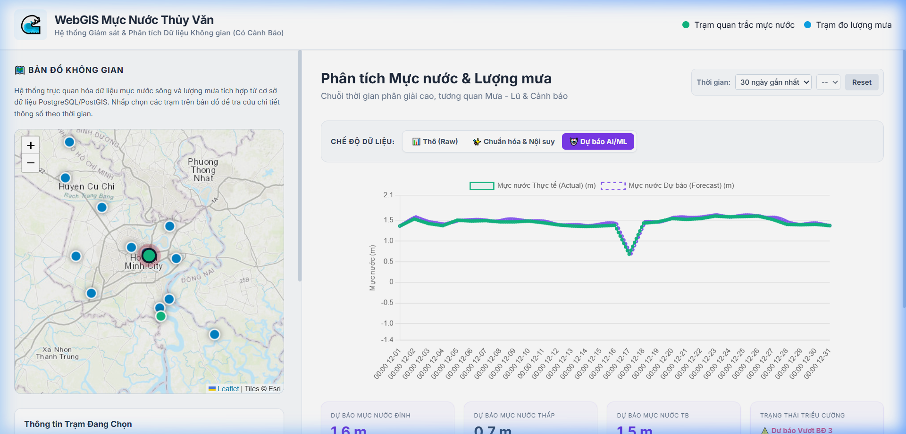
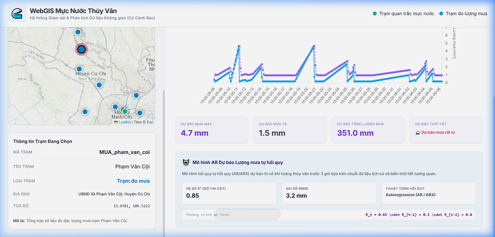
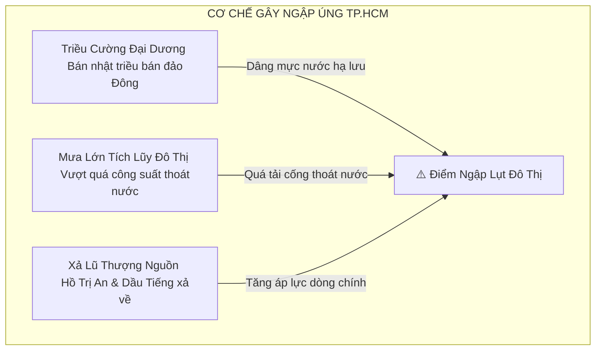
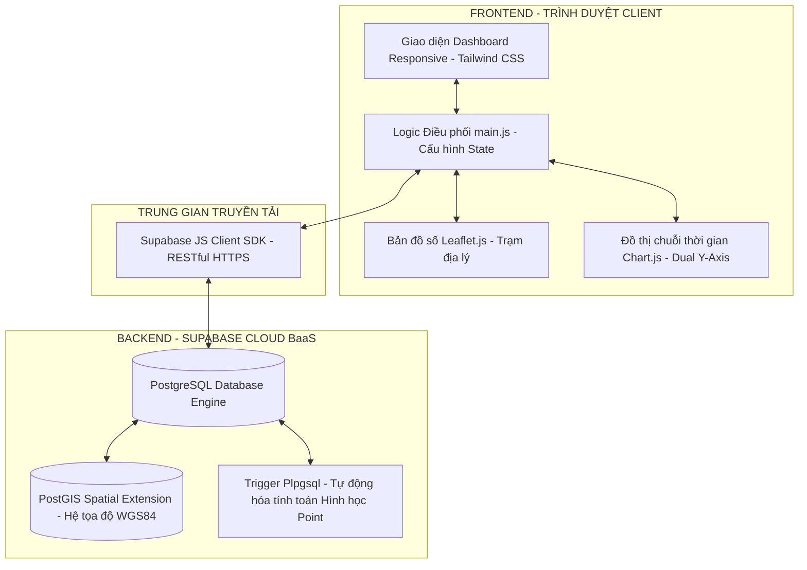
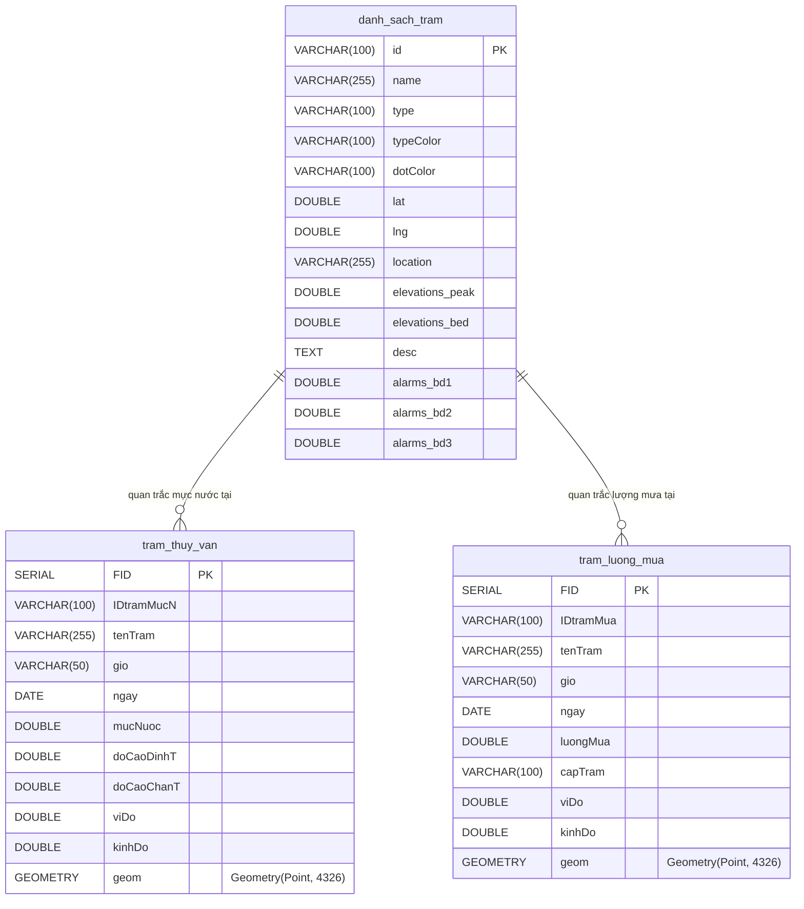
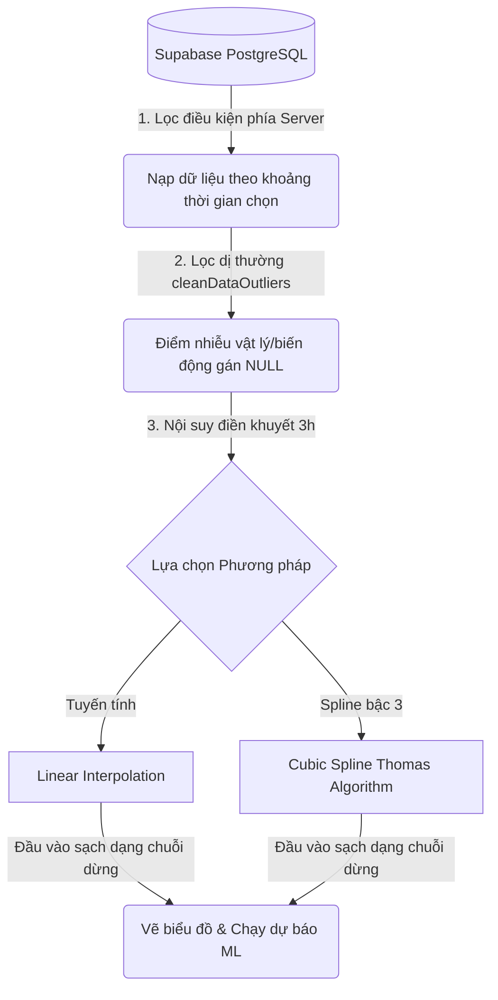
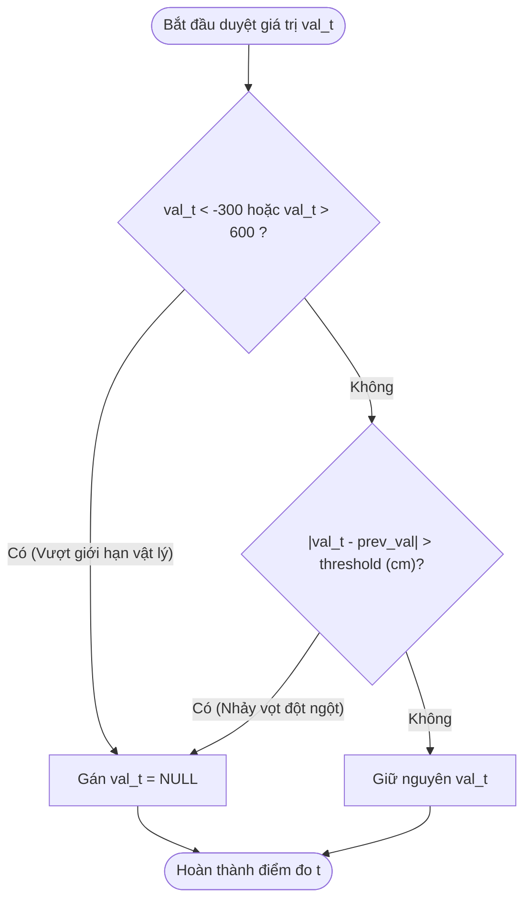
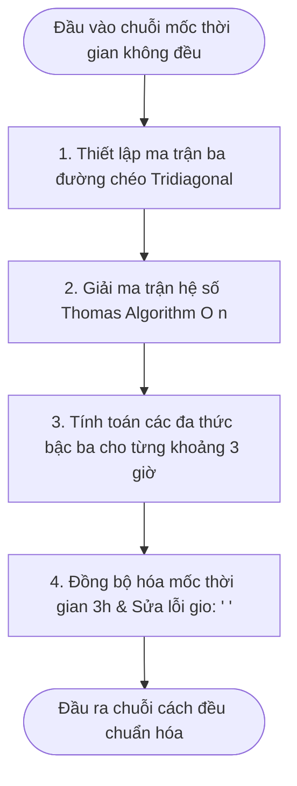
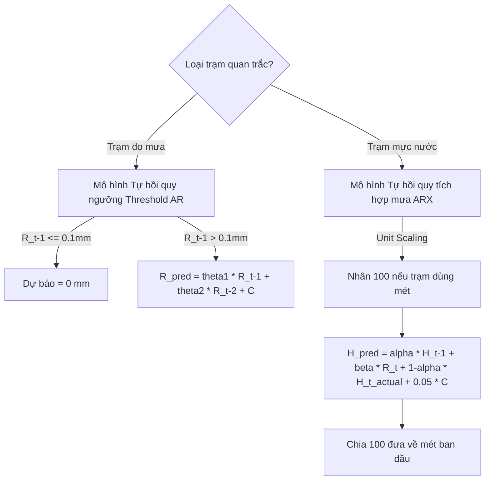
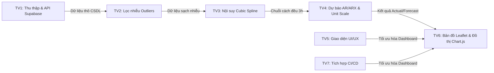

# ĐỒ ÁN MÔN HỌC: HỆ THỐNG WEBGIS GIÁM SÁT MỰC NƯỚC THỦY VĂN & LƯỢNG MƯA
> **Đề tài:** Thiết lập hệ thống WebGIS thời gian thực phục vụ giám sát triều cường, lượng mưa tích lũy và ứng dụng các mô hình học máy tự hồi quy (AR/ARX) dự báo sớm mực nước lưu vực TP. Hồ Chí Minh.
> **Nhóm thực hiện:** Nhóm 8 - Lớp OpenGIS - Đại học Nông Lâm TP.HCM.

---

## 📸 GIAO DIỆN THỰC TẾ HỆ THỐNG WEBGIS (PREMIUM DASHBOARD)

````carousel

<!-- slide -->

````

---

## 📌 BẢNG MỤC LỤC
1. [Đặt vấn đề & Sự cần thiết](#-1-dat-van-de--su-can-thiet)
2. [Kiến trúc hệ thống (System Architecture)](#-2-kien-truc-he-thong-system-architecture)
3. [Cấu trúc thư mục dự án](#-3-cau-truc-thu-muc-du-an)
4. [Mô hình hóa dữ liệu (Database Schema & Spatial ERD)](#-4-mo-hinh-hoa-du-lieu-database-schema--spatial-erd)
5. [Quy trình xử lý & Chuẩn hóa dữ liệu (Data Pipeline)](#-5-quy-trinh-xu-ly--chuan-hoa-du-lieu-data-pipeline)
6. [Mô hình dự báo tự hồi quy AI/ML (AR/ARX)](#-6-mo-hinh-du-bao-tu-hoi-quy-aiml-ararx)
7. [Phân chia vai trò thành viên nhóm làm việc](#-7-phan-chia-vai-tro-thanh-vien-nhom-lam-viec)
8. [Hướng dẫn cài đặt & Khởi chạy nhanh](#-8-huong-dan-cai-dat--khoi-chay-nhanh)
9. [Đánh giá kết quả thực nghiệm](#-9-danh-gia-ket-qua-thuc-nghiem)

---

## 📝 1. ĐẶT VẤN ĐỀ & SỰ CẦN THIẾT

Mô hình hóa 3 nhân tố chính gây ra ngập úng nghiêm trọng tại địa bàn TP. Hồ Chí Minh:



* **Mục tiêu hệ thống:** Thiết lập Dashboard WebGIS trực quan hóa không gian địa lý tương tác 2 chiều (Map $\leftrightarrow$ Chart) giúp giám sát và dự báo sớm triều cường/lượng mưa trước 3 giờ để ứng phó khẩn cấp.

---

## 📐 2. KIẾN TRÚC HỆ THỐNG (SYSTEM ARCHITECTURE)

Hệ thống hoạt động theo mô hình 3 lớp (3-Tier) không trạng thái (Stateless) tối ưu hiệu năng:



---

## 📂 3. CẤU TRÚC THƯ MỤC DỰ ÁN

```text
WebGIS_dashboad_thuyvan/
├── index.html                   # Giao diện chính của dashboard (Bản đồ Leaflet, Biểu đồ Chart.js)
├── build.js                     # Script Node.js tự động tạo config.js từ biến môi trường lúc Vercel build
├── vercel.json                  # Cấu hình deployment đầu ra cho Vercel (cleanUrls, outputDirectory: .)
├── assets/
│   ├── css/
│   │   └── style.css            # Custom CSS: Glassmorphism, kpi-card hover transitions, dark tooltips
│   └── js/
│       ├── config.example.js    # Cấu hình API mẫu
│       ├── config.js            # Khóa kết nối API Supabase thực tế (Bị bỏ qua bởi .gitignore)
│       └── main.js              # Xử lý Logic: API, Lọc Outliers, Cubic Spline, Dự báo AI/ML, UI Event
└── example_data/                # Dữ liệu mẫu dạng CSV (danh_sach_tram, tram_thuy_van, tram_luong_mua)
```

---

## 🗄️ 4. MÔ HÌNH HÓA DỮ LIỆU (DATABASE SCHEMA & SPATIAL ERD)

### 4.1. Sơ đồ Quan hệ Thực thể Địa lý (Spatial ERD)



---

## 💡 5. QUY TRÌNH XỬ LÝ & CHUẨN HÓA DỮ LIỆU (DATA PIPELINE)

### 5.1. Luồng dữ liệu tổng quát (Data Flow)



### 5.2. Thuật toán Lọc nhiễu Outlier (Thành viên 2)



### 5.3. Thuật toán Nội suy Cubic Spline bậc 3 & Thomas (Thành viên 3)



---

## 🤖 6. MÔ HÌNH DỰ BÁO TỰ HỒI QUY AI/ML (AR/ARX)

Hệ thống tích hợp hai mô hình toán học dự báo nhanh bước tiếp theo ($t+3h$):



### 6.1. Tham số thực nghiệm giả sử cấu hình sẵn (Empirical Parameters)
* **Trạm đo mưa (Default AR):** $\theta_1 = 0.65, \theta_2 = 0.20, C_{rain} = 0.8\text{ mm}$ (Đánh giá: $R^2 = 0.85, RMSE = 3.2\text{ mm}$).
* **Trạm mực nước (ARX):**

| Mã Trạm | Tên Trạm | Hệ số $\alpha$ | Hệ số $\beta$ | Hằng số $C$ | Hệ số tin cậy $R^2$ | Sai số $RMSE$ |
| :--- | :--- | :--- | :--- | :--- | :--- | :--- |
| `MN_phu_an` | Phú An | 0.88 | 0.15 | 15.0 | 0.92 | 6.8 cm |
| `MN_nha_be` | Nhà Bè | 0.89 | 0.12 | 12.5 | 0.93 | 5.5 cm |
| `MN_bien_hoa`| Biên Hòa | 0.85 | 0.18 | 18.0 | 0.91 | 7.2 cm |
| `MN_thu_dau_mot`| Thủ Dầu Một | 0.84 | 0.20 | 20.2 | 0.90 | 8.5 cm |
| `MN_tan_an` | Tân An | 0.82 | 0.22 | 22.0 | 0.89 | 9.1 cm |

---

## 👥 7. PHÂN CHIA VAI TRÒ THÀNH VIÊN NHÓM LÀM VIỆC

Sơ đồ phối hợp và luồng chuyển giao dữ liệu giữa các thành viên:



---

## 🛠️ 8. HƯỚNG DẪN CÀI ĐẶT & KHỞI CHẠY NHANH

### Bước 8.1: Thiết lập CSDL trên SQL Editor của Supabase
Dán đoạn mã DDL dưới đây để khởi tạo bảng và chỉ mục tối ưu hiệu năng:

```sql
-- Kích hoạt tiện ích PostGIS không gian địa lý
CREATE EXTENSION IF NOT EXISTS postgis;

-- Tạo bảng CSDL
CREATE TABLE danh_sach_tram (
    id VARCHAR(100) PRIMARY KEY,
    name VARCHAR(255) NOT NULL,
    type VARCHAR(100),
    "typeColor" VARCHAR(100),
    "dotColor" VARCHAR(100),
    lat DOUBLE PRECISION,
    lng DOUBLE PRECISION,
    location VARCHAR(255),
    elevations_peak DOUBLE PRECISION,
    elevations_bed DOUBLE PRECISION,
    "desc" TEXT,
    alarms_bd1 DOUBLE PRECISION,
    alarms_bd2 DOUBLE PRECISION,
    alarms_bd3 DOUBLE PRECISION
);

-- Bảng thủy văn mực nước sông
CREATE TABLE tram_thuy_van (
    "FID" SERIAL PRIMARY KEY,
    "IDtramMucN" VARCHAR(100),
    "tenTram" VARCHAR(255),
    "gio" VARCHAR(50),
    "ngay" DATE,
    "mucNuoc" DOUBLE PRECISION,
    "kinhDo" DOUBLE PRECISION,
    "viDo" DOUBLE PRECISION,
    geom GEOMETRY(Point, 4326)
);

-- Lập chỉ mục Index phục vụ tìm kiếm nhanh (Tối ưu hóa CSDL)
CREATE INDEX idx_thuy_van_ten_tram_ngay ON tram_thuy_van("tenTram", "ngay");
```

### Bước 8.2: Cấu hình và chạy thử local
1. Đổi tên tệp [config.example.js](file:///c:/Users/admin/Desktop/opengis/WebGIS_dashboad_thuyvan/assets/js/config.example.js) thành `config.js` và điền khóa kết nối của bạn.
2. Khởi động server tĩnh local tại thư mục gốc:
   ```bash
   python -m http.server 5500
   ```
3. Truy cập địa chỉ `http://localhost:5500`.

---

## 📈 9. ĐÁNH GIÁ KẾT QUẢ THỰC NGHIỆM

* **Tối ưu hóa:** Lọc dữ liệu động phía Server giúp giảm dung lượng tải mạng từ hàng chục MB xuống **dưới 15KB** mỗi lần chuyển đổi trạm.
* **Giao diện hiện đại:** Phong cách Glassmorphic chuyên nghiệp, cảnh báo triều cường đồng bộ tức thời khi mực nước dự báo vượt ngưỡng báo động lũ quy chuẩn.
* **Mô hình tin cậy:** Cơ chế Threshold AR xử lý triệt để hiện tượng nhiễu giả lập mưa trong mùa khô, đảm bảo chất lượng hiển thị tin cậy.

---
**Nhóm tác giả Đồ án môn học WebGIS - Đồ án thực nghiệm khoa học**
*Chúc các bạn cài đặt và khai thác thành công hệ thống giám sát thủy văn!*
